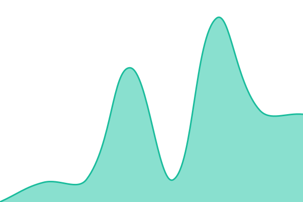

# [📈 Live Status](https://taleex.github.io/ST-uptime-taleex): <!--live status--> **🟧 Partial outage**

This repository contains the open-source uptime monitor and status page for [Jorge Matos](https://taleex.github.io/ST-uptime-taleex), powered by [Upptime](https://github.com/upptime/upptime).

With [Upptime](https://upptime.js.org), you can get your own unlimited and free uptime monitor and status page, powered entirely by a GitHub repository. We use [Issues](https://github.com/taleex/ST-uptime-taleex/issues) as incident reports, [Actions](https://github.com/taleex/ST-uptime-taleex/actions) as uptime monitors, and [Pages](https://taleex.github.io/ST-uptime-taleex) for the status page.

<!--start: status pages-->
<!-- This summary is generated by Upptime (https://github.com/upptime/upptime) -->
<!-- Do not edit this manually, your changes will be overwritten -->
<!-- prettier-ignore -->
| URL | Status | History | Response Time | Uptime |
| --- | ------ | ------- | ------------- | ------ |
|  [LP_Taleex](https://taleex.netlify.app/) | 🟩 Up | [lp-taleex.yml](https://github.com/taleex/ST-uptime-taleex/commits/HEAD/history/lp-taleex.yml) | 

 621ms
     
 | 

<a href="https://taleex.github.io/ST-uptime-taleex/history/lp-taleex">97.66%</a>
    

|  [Supabase FMG](https://ijrxbvugxiizlsuhgelp.supabase.co/auth/v1/settings) | 🟥 Down | [supabase-fmg.yml](https://github.com/taleex/ST-uptime-taleex/commits/HEAD/history/supabase-fmg.yml) | 

 0ms
     
 | 

<a href="https://taleex.github.io/ST-uptime-taleex/history/supabase-fmg">0.00%</a>
    

|  [Supabase Taleex](https://ooefpodiqdupfpyqmaif.supabase.co/auth/v1/settings) | 🟩 Up | [supabase-taleex.yml](https://github.com/taleex/ST-uptime-taleex/commits/HEAD/history/supabase-taleex.yml) | 

 975ms
     
 | 

<a href="https://taleex.github.io/ST-uptime-taleex/history/supabase-taleex">100.00%</a>
    

|  [Supabase Nexor](https://xbdreylpzvtswvvktjjn.supabase.co/auth/v1/settings) | 🟥 Down | [supabase-nexor.yml](https://github.com/taleex/ST-uptime-taleex/commits/HEAD/history/supabase-nexor.yml) | 

 0ms
     
 | 

<a href="https://taleex.github.io/ST-uptime-taleex/history/supabase-nexor">0.00%</a>
    

|  [Neon PetSoft DB](https://ep-fancy-cherry-aput4oz0.apirest.c-7.us-east-1.aws.neon.tech/neondb/rest/v1) | 🟥 Down | [neon-pet-soft-db.yml](https://github.com/taleex/ST-uptime-taleex/commits/HEAD/history/neon-pet-soft-db.yml) | 

 102ms
     
 | 

<a href="https://taleex.github.io/ST-uptime-taleex/history/neon-pet-soft-db">0.00%</a>
    

|  [CR_PetSoft](https://taleex-petsoft.vercel.app/) | 🟩 Up | [cr-pet-soft.yml](https://github.com/taleex/ST-uptime-taleex/commits/HEAD/history/cr-pet-soft.yml) | 

 1033ms
     
 | 

<a href="https://taleex.github.io/ST-uptime-taleex/history/cr-pet-soft">100.00%</a>
    

|  [CR-evento](https://taleex-cr-evento.vercel.app/) | 🟩 Up | [cr-evento.yml](https://github.com/taleex/ST-uptime-taleex/commits/HEAD/history/cr-evento.yml) | 

 144ms
     
 | 

<a href="https://taleex.github.io/ST-uptime-taleex/history/cr-evento">100.00%</a>
    

|  [CR-rmtDev](https://taleex-rmtdev.netlify.app/) | 🟩 Up | [cr-rmt-dev.yml](https://github.com/taleex/ST-uptime-taleex/commits/HEAD/history/cr-rmt-dev.yml) | 

 567ms
     
 | 

<a href="https://taleex.github.io/ST-uptime-taleex/history/cr-rmt-dev">97.76%</a>
    

|  [CR-CorpComment](https://taleex-corpcomment.netlify.app/) | 🟩 Up | [cr-corp-comment.yml](https://github.com/taleex/ST-uptime-taleex/commits/HEAD/history/cr-corp-comment.yml) | 

 613ms
     
 | 

<a href="https://taleex.github.io/ST-uptime-taleex/history/cr-corp-comment">97.81%</a>
    

|  [CR_trekbag-app](https://taleex-trekbag.netlify.app/) | 🟩 Up | [cr-trekbag-app.yml](https://github.com/taleex/ST-uptime-taleex/commits/HEAD/history/cr-trekbag-app.yml) | 

 548ms
     
 | 

<a href="https://taleex.github.io/ST-uptime-taleex/history/cr-trekbag-app">97.85%</a>
    

|  [CR_Word-Analytics](https://taleex-word-analytics.netlify.app/) | 🟩 Up | [cr-word-analytics.yml](https://github.com/taleex/ST-uptime-taleex/commits/HEAD/history/cr-word-analytics.yml) | 

 555ms
     
 | 

<a href="https://taleex.github.io/ST-uptime-taleex/history/cr-word-analytics">97.90%</a>
    

|  [CR_Fancy-Counter](https://taleex-fancycounter.netlify.app/) | 🟩 Up | [cr-fancy-counter.yml](https://github.com/taleex/ST-uptime-taleex/commits/HEAD/history/cr-fancy-counter.yml) | 

 679ms
     
 | 

<a href="https://taleex.github.io/ST-uptime-taleex/history/cr-fancy-counter">97.95%</a>
    

|  [LP_steammarket-analytics](https://taleex-steammarket-analytics.netlify.app/) | 🟩 Up | [lp-steammarket-analytics.yml](https://github.com/taleex/ST-uptime-taleex/commits/HEAD/history/lp-steammarket-analytics.yml) | 

 684ms
     
 | 

<a href="https://taleex.github.io/ST-uptime-taleex/history/lp-steammarket-analytics">98.00%</a>
    

|  [LP_valentine](https://taleex-valentine.netlify.app/) | 🟩 Up | [lp-valentine.yml](https://github.com/taleex/ST-uptime-taleex/commits/HEAD/history/lp-valentine.yml) | 

 585ms
     
 | 

<a href="https://taleex.github.io/ST-uptime-taleex/history/lp-valentine">98.04%</a>
    

|  [SC_Games-Library](http://taleex-games-library.infinityfree.me/index.php) | 🟩 Up | [sc-games-library.yml](https://github.com/taleex/ST-uptime-taleex/commits/HEAD/history/sc-games-library.yml) | 

 526ms
     
 | 

<a href="https://taleex.github.io/ST-uptime-taleex/history/sc-games-library">100.00%</a>
    

<!--end: status pages-->

[**Visit our status website →**](https://taleex.github.io/ST-uptime-taleex)

## 📄 License

- Powered by: [Upptime](https://github.com/upptime/upptime)
- Code: [MIT](./LICENSE) © [Anand Chowdhary](https://anandchowdhary.com), supported by [Pabio](https://pabio.com)
- Data in the `./history` directory: [Open Database License](https://opendatacommons.org/licenses/odbl/1-0/)
